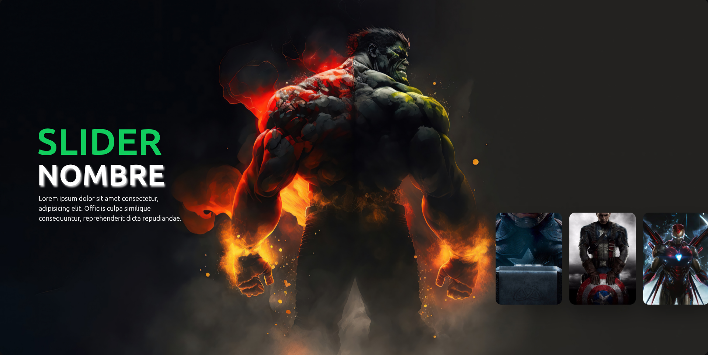

# 🎠 Reflex Carrusel Template - Reflex Carousel Template



Este es un template desarrollado con [Reflex](https://reflex.dev), que incluye un elegante efecto de carrusel responsivo, ideal como base para proyectos web modernos en Python.

This is a template built with [Reflex](https://reflex.dev), featuring a clean, responsive carousel effect — a perfect starting point for modern web projects in Python.

---

## 🚀 Instalación / Installation

### 📌 Requisitos / Requirements

- Python 3.10+
- Git
- Virtualenv (opcional, pero recomendado)

---

### 🛠️ Pasos para correr el proyecto / Steps to run the project

#### 🇪🇸 En Español:

```bash
# 1. Clona el repositorio
git clone https://github.com/Emmanuel726/Carrusel_Reflex_Python.git
cd Carrusel_Reflex_Python

# 2. Crea y activa un entorno virtual (opcional pero recomendado)
python -m venv venv
source venv/bin/activate   # En Windows: venv\Scripts\activate

# 3. Instala Reflex
pip install reflex

# 4. Instala las dependencias del proyecto (si aplica)
# reflex automáticamente las gestiona al correr el proyecto

# 5. Ejecuta el servidor
reflex run

# 6. Abre tu navegador en http://localhost:3000
```

#### 🇺🇸 In English:
```bash
# 1. Clone the repository
git clone https://github.com/Emmanuel726/Carrusel_Reflex_Python.git
cd Carrusel_Reflex_Python

# 2. Create and activate a virtual environment (optional but recommended)
python -m venv venv
source venv/bin/activate   # On Windows: venv\Scripts\activate

# 3. Install Reflex
pip install reflex

# 4. Install project dependencies (if applicable)
# reflex manages them automatically when running the project

# 5. Run the server
reflex run

# 6. Open your browser at http://localhost:3000
```
---

# 🎯 Características / Features
-  🎡 Carrusel completamente funcional / Fully functional carousel
-  📱 Diseño responsive adaptado a dispositivos móviles / Responsive design for mobile devices
-  🎨 Fácil personalización de imágenes y estilos / Easy customization of images and styles
-  ⚙️ Base limpia lista para extender / Clean base ready to extend

---

# 🫶 Apóyame / Support Me
Si este proyecto te fue útil y quieres apoyar su desarrollo, considera hacer una donación. ¡Cualquier ayuda es muy apreciada! 🙏

If this project helped you and you'd like to support its development, feel free to make a donation. Any support is greatly appreciated! 🙏

# 💳 Donaciones / Donations

<div align="center">
  <a href="https://www.paypal.com/cgi-bin/webscr?cmd=_s-xclick&hosted_button_id=E35UMDRP8TKLW" target="_blank">
    
  </a>
</div>

---

<div align="center">
    
</div>

## 📫 Contacto / Contact

Autor / Author: Emmanuel Perez

Email: perezemmanuel726@gmail.com

